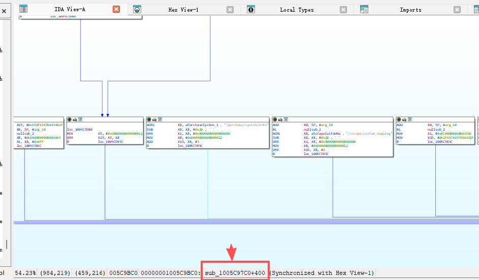
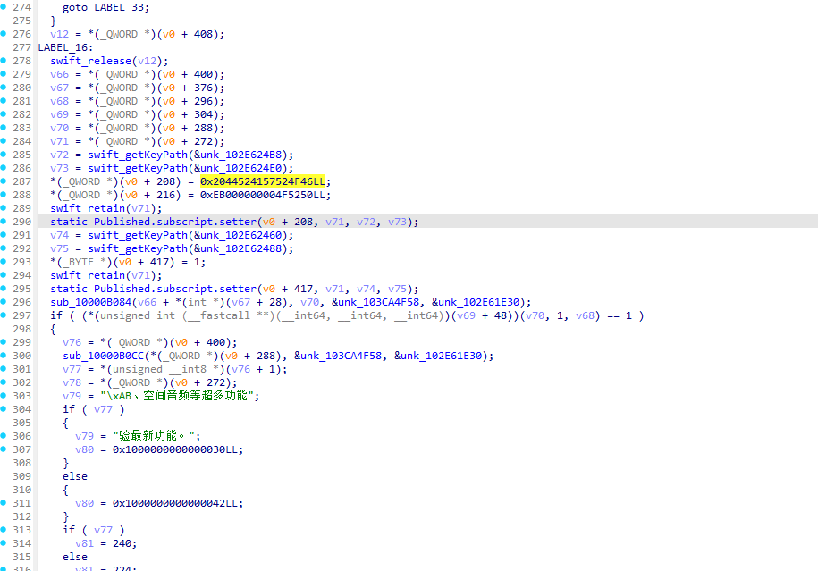
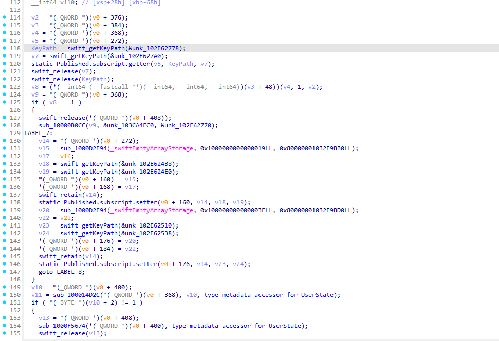
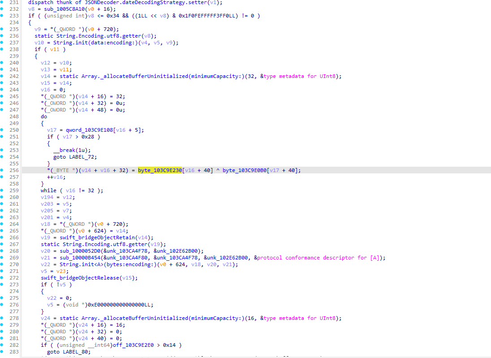
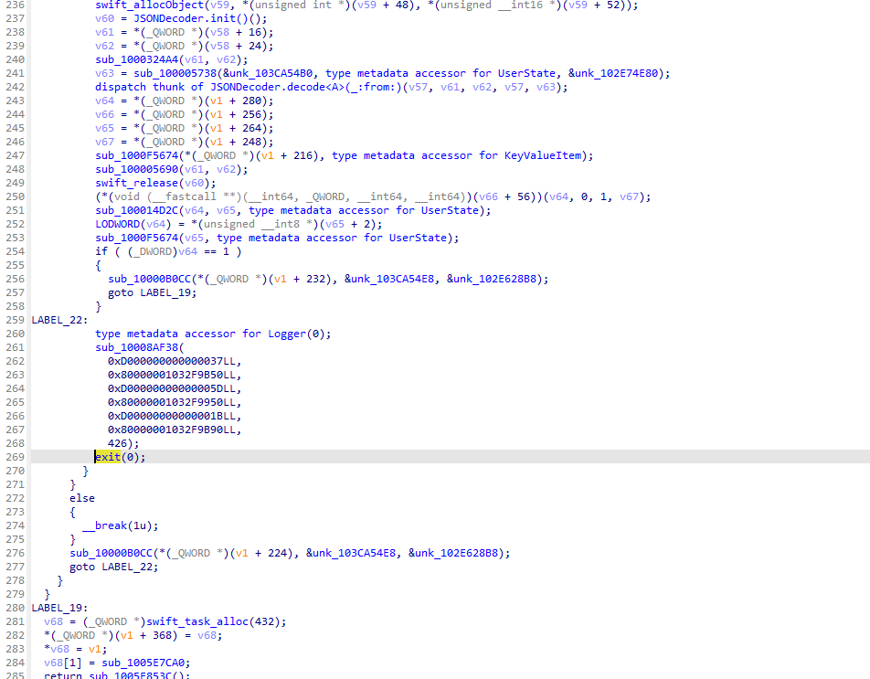

<h1 align="center">
  <code>F &nbsp; L &nbsp; U &nbsp; X</code>
  <br>
  <sub>内购到底是苹果还是服务器？— 订阅验证机制分析</sub>
</h1>

> **免责声明**: 本文仅为技术研究与学习目的，对 Flux 的订阅验证机制进行静态分析。不涉及任何破解、绵过付费或侵犯开发者权益的行为。如有侵权请联系删除。

## 总结

1. **验证方式**: 服务器为主，Apple StoreKit 2 为辅。服务器宕机 = 订阅丢失
2. **服务器可以直接控制 userId 的 PRO 权益**: 通过 iCloudId + deviceId 识别用户，服务器端存储和管理订阅状态
3. **本地缓存**: WCDB 数据库 + Keychain，但只是服务器状态的缓存副本
4. **连续验证失败时会清除缓存**: `"连续验证失败 N 次，清除授权缓存"` — 服务器不可用时订阅会丢失
5. **`/115/updateToken`** 是 115网盘 Token 刷新，与订阅无关

---

## 1. 基本信息

| 项目 | 值 |
|------|-----|
| App 名称 | Flux（暂且这么叫它） |
| 开发者源码路径 | `/Users/johnil/Work/git/Flux_Apple/`（二进制中硬编码的编译路径，来自 `__cstring` 段） |
| 包结构 | `Packages/Client/Sources/Client/` |
| 服务器域名 | [REDACTED] |
| API 基路径 | [REDACTED]/v1 |
| AES 加密 | AES-256-CBC，Key/IV 通过 XOR 混淆存储于二进制数据段（具体值已脱敏） |
| TMDB 代理密钥 | [REDACTED — `__cstring` 段常量名已脱敏] |
| YTB 解码密钥 | [REDACTED — `__cstring` 段常量名已脱敏] |
| Trailer 服务器 | [REDACTED] |
| Telegram 邀请 | [REDACTED] |
| Image Base | `0x100000000` (见 [evidence/segments.txt](evidence/segments.txt)) |

---

## 2. 验证方式结论：混合验证（服务器为主）

### 核心结论

**服务器是订阅状态的权威方。**

#### 证据 1：实际抓包验证

未订阅用户调用 `/v1/purchase/system/detail` 后，服务器响应（AES 解密后）的 `data` 字段只有 `{"ok":true}`，**不包含 `isSubscribed`/`isEarlyBird` 等字段** — 服务器根据 uid 判定无订阅，不返回订阅数据。App 收到后走 LABEL_7 非 PRO 路径。

> API 路由函数 `sub_1005C97C0` 包含所有端点引用：
> 

#### 证据 2：二进制中的 UserState 模型字段

`__swift5_fieldmd` 段 `0x1037653D8` 定义了 UserState 结构：`isOEM`, `isEarlyBird`, `isSubscribed`, `expiresDate` — 这些字段**全部来自服务器响应的 `data` 字段**，由 `JSONDecoder.decode` 解析（见 [evidence/setupState.c 行 237-244](evidence/setupState.c)）。

#### 证据 3：验证失败 = 订阅丢失

二进制中硬编码了 `"连续验证失败 N 次，清除授权缓存"` (`0x1032F9EF0`)，说明服务器不可用时 app 主动清除本地订阅状态。

### 验证流程

```
Apple 付款
  → StoreKit 2 本地获取 transactionId (Transaction.currentEntitlements)
  → checkVerified(_:) 本地验证交易签名
  → /purchase/iap/bind 发送 originalTransactionId 到服务器绑定 (iCloudId + deviceId)
  → 服务器验证并存储用户 PRO 状态
  → /purchase/system/detail 返回 AES-256-CBC 加密的 UserState
  → app 解密 → JSON decode 为 UserState 结构
  → 存入 WCDB 数据库 (KeyValueItem 表) + iOS Keychain
  → SwiftUI @Published 属性更新 UI
```

### 用户身份识别

服务器通过 **iCloudId + deviceId** 识别用户：
- 函数: `setupWith(icloudId:deviceId:refresh:)` (字符串地址: `0x1032F9850`)
- 属性: `authContextUseId` (字符串地址: `0x1032F9880`)
- 类: `FluxClient` (`_TtC6Client10FluxClient`, 字符串地址: `0x1032F98A0`)

### 设备绑定限制

服务器控制设备绑定数量：
- `"仅可绑定一个 iCloud 账号，请先解绑现有账号。"` (地址: `0x1032F9A10`)
- `"绑定设备已满，请先解绑其他设备。"` (地址: `0x1032F9A50`)
- `"没有找到收据，你没有权限进行该操作。"` (地址: `0x1032F9A90`)

---

## 3. 服务器 API 端点

### 订阅/购买相关

| 端点 | 字符串地址 | 引用函数 | 作用 |
|------|-----------|----------|------|
| `/purchase/system/detail` | `0x1032F9530` | `sub_1005C97C0` (XREF: `0x1005C9810`) | **主接口**: 获取加密的当前订阅状态 |
| `/purchase/iap/subscription` | `0x1032F9610` | `sub_1005C97C0` (XREF: `0x1005C9A4C`) | IAP 订阅验证 |
| `/purchase/iap/bind` | `0x1032F9650` | `sub_1005C97C0` | 绑定交易到 iCloud 账号 |
| `/purchase/iap/unbind` | `0x1032F9630` | `sub_1005C97C0` | 解绑交易 |
| `/purchase/iap/binding-type` | `0x1032F95F0` | `sub_1005C97C0` | 查询绑定类型 |
| `/purchase/system/info` | `0x1032F96B0` | `sub_1005C97C0` (XREF: `0x1005C99C0`) | 系统购买信息 |
| `/purchase/system/hitReport` | `0x1032F9690` | `sub_1005C97C0` (XREF: `0x1005C9B70`) | 点击上报 |
| `/purchase/iap/ping` | `0x1032F96D0` | `sub_1005C97C0` (XREF: `0x1005C9988`) | IAP 心跳检测 |
| `/purchase/products` | `0x1032F9670` | `sub_1005C97C0` | 获取商品列表 |
| `/purchase/discount` | `0x1032F97D0` | `sub_1005C97C0` | 折扣信息 |
| `/purchase/testflight/invite` | `0x1032F9790` | `sub_1005C97C0` | TestFlight 邀请 |
| `/referral/invite-code/product` | `0x1032F95D0` | `sub_1005C97C0` | 邀请码商品 |

### 用户认证

| 端点 | 字符串地址 | 作用 |
|------|-----------|------|
| `/user/refreshToken` | `0x1032F9810` | 刷新用户 Token |
| `/user/token_usage` | `0x1032F97B0` | Token 使用统计 |

### 第三方云盘集成（与订阅无关）

| 端点 | 字符串地址 | 作用 |
|------|-----------|------|
| `/115/updateToken` | `0x1032F9770` | 115网盘 Token 刷新 |
| `/onedrive/checkLogin` | `0x1032F9710` | OneDrive 登录检查 |
| `/onedrive/devicecode` | `0x1032F9730` | OneDrive 设备码 |
| `/onedrive/getToken` | `0x1032F9750` | OneDrive 获取 Token |
| `/trakt/device/token` | `0x1032F96F0` | Trakt 设备 Token |

### API 路由器函数

**`sub_1005C97C0`** — 所有 API 端点的路由/构造函数，包含全部端点字符串引用。在 IDA 中引用了 `/115/updateToken` 的位置:
- ADRL 指令地址: `0x1005C9A7C`

---

## 4. 关键函数地址 (IDA)

### ForwardPurchasesCenter 类

| 函数名 | 虚拟地址 | 大小 | 作用 |
|--------|---------|------|------|
| `checkPurcahse(ignoreCache:)` | `0x1005E7414` | 2188 bytes | 主订阅检查入口 ([asm](evidence/checkPurcahse.asm) / [c](evidence/checkPurcahse.c)) |
| `setupStateWithPurchase()` | `0x1005E8718` | 2804 bytes | 设置 PRO 状态和 UI 属性 ([asm](evidence/setupState.asm) / [c](evidence/setupState.c)) |
| `checkVerified(_:)` | `0x1005E5954` | 340 bytes | StoreKit 2 本地验证交易签名 |
| `loadTransationId()` | `0x1005E5F34` | 300 bytes | 从 StoreKit 加载交易 ID |
| `listenForTransactionUpdates()` | `0x1005E4CC0` | 464 bytes | 监听 StoreKit 交易更新 |
| `sub_1005E00F8` (BindingData 处理) | `0x1005E00F8` | 1696 bytes | 处理 UserState.BindingData |
| `sub_1005E1730` (Keychain 通知) | `0x1005E1730` | — | 写入 isSubscribed 到 Keychain |
| `sub_1005E1954` (Keychain 存储) | `0x1005E1954` | — | 管理 Keychain 读写 (purchaseNotification/_bv) |

### 数据模型

| 符号 | 虚拟地址 | 说明 |
|------|---------|------|
| `ForwardPurchasesCenter` 类元数据 | `0x1005ECC04` | `_TtC6Client22ForwardPurchasesCenter` |
| `PurchaseEvent` 元数据 | `0x1005ECE64` | 购买事件枚举 |
| `Purchase` 模型元数据 | `0x100542ECC` | `$s6Models8PurchaseCMa` |
| `TransactionBinding` 模型元数据 | `0x100543380` | `$s6Models18TransactionBindingVMa` |
| `FluxClient` 类 | — | `_TtC6Client10FluxClient` (字符串: `0x1032F98A0`) |

---

## 5. 本地存储

### WCDB 数据库 (反编译见 [evidence/setupState.c](evidence/setupState.c) 行 160-268)

- 存储表: `KeyValueItem`
- 存储内容: `UserState` JSON 序列化数据
- 关键字段: `UserState.byte[2]` = 订阅状态 (1=已订阅, 0=未订阅)
- 完整性检查: `"Database config integrity check failed, corrupted index"` (`0x1032F9B70`)
- 迁移检查: `"KeyValue table migration failed, missing required entries"` (`0x1032F9CC0`)

### iOS Keychain (字符串见 [evidence/keychain_values.txt](evidence/keychain_values.txt))

| 属性 | 值 |
|------|-----|
| kSecClass | `kSecClassGenericPassword` |
| kSecAttrService | `purchaseNotification` (地址: `0x1032F9E90`) |
| kSecAttrAccount | `_bv` (解码自 `7758431`) |

### UserState 结构

来源: `__swift5_fieldmd` 段 `0x1037653D8` 字段元数据 (见 [evidence/sub_check.txt](evidence/sub_check.txt) 行 3-9)

```
偏移 0x000 (byte[0]): isOEM      — 是否 OEM 版本
偏移 0x001 (byte[1]): isEarlyBird — 是否早期支持者 (见 §6.4 文案分支证据)
偏移 0x002 (byte[2]): isSubscribed — 订阅状态 (1=PRO, 0=免费)
偏移 0x003+:          expiresDate — 到期日期
```

`__swift5_fieldmd` 原始证据 (`sub_check.txt` 行 3-9):
```
'isOEM' ref at 0x1037653d8 in __swift5_fieldmd
'isEarlyBird' ref at 0x1037653d8 in __swift5_fieldmd
'isSubscribed' ref at 0x1037653d8 in __swift5_fieldmd
'expiresDate' ref at 0x1037653d8 in __swift5_fieldmd
```

### ForwardPurchasesCenter @Published 属性

| 属性名 | 实例偏移 | 说明 |
|--------|---------|------|
| `_proTitle` | +160~+208 | PRO 标题 (如 "FORWARD PRO") |
| `_proSubTitle` | +176~+216 | PRO 副标题 |
| `isSubscribed` | +417 (0x1A1) | 是否已订阅 (Bool) |
| `_canPurchaseLifeTime` | +418 (0x1A2) | 是否可购买终身版 (Bool) |
| `_countdownTitle` | — | 倒计时标题 |
| `_inviteCode` | — | 邀请码 |
| `_isPurchasing` | — | 是否正在购买 |
| `_isPurchaseSuccess` | — | 购买是否成功 |
| `_purchaseFailedMessage` | — | 购买失败消息 |
| `_isPurchaseFailed` | — | 购买是否失败 |
| `_originalTransationId` | — | 原始交易 ID |

### isSubscribed 全局写入点 (搜索结果见 [evidence/find_isSubscribed.txt](evidence/find_isSubscribed.txt)，上下文见 [evidence/strb_context.txt](evidence/strb_context.txt))

| 虚拟地址 | 文件偏移 | 指令 | 所在函数 | 说明 |
|---------|---------|------|----------|------|
| `0x1005E175C` | `0x5E175C` | `STRB W0, [X22,#0x1A1]` | `sub_1005E1730` | Keychain 通知回调写入 |
| `0x1005E8E24` | `0x5E8E24` | `STRB W8, [X22,#0x1A1]` | `sub_1005E8718` (setupState) | PRO 路径写入 true |
| `0x100CE35D8` | `0xCE35D8` | `STRB WZR, [X22,#0x1A1]` | `sub_100CE3234` | 其他类初始化 (同偏移不同类) |
| `0x101C27B5C` | `0x1C27B5C` | `STRB W0, [X21,#0x1A1]` | `sub_101C27534` | 其他写入点 |
| `0x101C2C324` | `0x1C2C324` | `STRB W8, [X21,#0x1A1]` | `sub_101C2C22C` | 条件写入 |
| `0x101C2C3C8` | `0x1C2C3C8` | `STRB W8, [X21,#0x1A1]` | `sub_101C2C22C` | 条件写入 |
| `0x101C2C454` | `0x1C2C454` | `STRB WZR, [X21,#0x1A1]` | `sub_101C2C22C` | 重置为 false |
| `0x101C2C474` | `0x1C2C474` | `STRB WZR, [X21,#0x1A1]` | `sub_101C2C22C` | 重置为 false |
| `0x101D1AA24` | `0x1D1AA24` | `STRB WZR, [X19,#0x1A1]` | `sub_101D1A838` | 重置为 false |
| `0x101D1B194` | `0x1D1B194` | `STRB W8, [X20,#0x1A1]` | `sub_101D1B0F8` | 条件写入 |
| `0x101DEDE0C` | `0x1DEDE0C` | `STRB W25, [X10,#0x1A1]` | `sub_101DEDD34` | 条件写入 |
| `0x101DEE018` | `0x1DEE018` | `STRB W25, [X10,#0x1A1]` | `sub_101DEDF40` | 条件写入 |

---

## 6. PRO 状态显示文案

来源：`setupStateWithPurchase()` (`sub_1005E8718`) 的反编译代码和汇编
- 汇编: [evidence/setupState.asm](evidence/setupState.asm)
- 反编译: [evidence/setupState.c](evidence/setupState.c)

### 6.1 "FORWARD PRO" — proTitle (PRO 路径)

**汇编** ([evidence/setupState.asm 行 387-396](evidence/setupState.asm)):
```asm
0x1005e8dc4  MOV  X8, #0x2044524157524F46   ; "FORWARD " (little-endian ASCII)
0x1005e8dd4  MOV  X9, #0xEB000000004F5250   ; "PRO" + Swift tagged pointer flags
0x1005e8de0  STP  X8, X9, [X22,#0xD0]       ; 写入 proTitle 属性
0x1005e8dfc  BL   static Published.subscript.setter  ; 通过 @Published 更新 UI
```
**反编译** ([evidence/setupState.c 行 287-290](evidence/setupState.c)):
```c
*(_QWORD *)(v0 + 208) = 0x2044524157524F46LL;  // "FORWARD "
*(_QWORD *)(v0 + 216) = 0xEB000000004F5250LL;  // "PRO"
static Published.subscript.setter(v0 + 208, v71, v72, v73);
```
**说明**: 内联小字符串，直接在寄存器中构造。仅在 PRO 路径 (LABEL_16，`isSubscribed == 1`) 执行。

> IDA 伪代码视图 — LABEL_16 PRO 路径，行 287-293 可见 `0x2044524157524F46` + `isSubscribed` 写入 + `isEarlyBird` 分支:
> 

> 函数整体结构 — 行 125 `if (v8 == 1)` 分支、LABEL_7 非 PRO 路径、行 151 `byte[2] != 1` 检查:
> 

### 6.2 "PRO 限时免费试用中" — proTitle (非 PRO 路径/LABEL_7)

**汇编** ([evidence/setupState.asm 行 62-70](evidence/setupState.asm)):
```asm
0x1005e8824  ADRL X8, aPro              ; "PRO 限时免费试用中" (字符串地址 0x1032F9BD0)
0x1005e882c  SUB  X8, X8, #0x20
0x1005e8850  BL   sub_1000D2F94          ; 构造 Swift String
```
**反编译** ([evidence/setupState.c 行 131-146](evidence/setupState.c)):
```c
// LABEL_7: 非 PRO 路径 (byte[2] != 1 或数据库为空)
v15 = sub_1000D2F94(_swiftEmptyArrayStorage, 0x1000000000000019, 0x80000001032F9BB0);
// ↑ 0x1032F9BB0 + 0x20 = 0x1032F9BD0 → "PRO 限时免费试用中"，长度 0x19
static Published.subscript.setter(v0 + 160, v14, v18, v19);  // 设置 proTitle
```

### 6.3 "解锁 4K杜比画面、AI 识别、空间音频等超多功能" — proSubTitle (非 PRO 路径/LABEL_7)

**汇编** ([evidence/setupState.asm 行 87-93](evidence/setupState.asm)):
```asm
0x1005e889c  ADRL X8, a4kAi             ; "解锁 4K杜比画面、AI 识别、空间音频等超多功能" (字符串地址 0x1032F9BF0)
0x1005e88a4  SUB  X8, X8, #0x20
0x1005e88b8  BL   sub_1000D2F94          ; 构造 Swift String
```
**反编译** ([evidence/setupState.c 行 139-146](evidence/setupState.c)):
```c
v20 = sub_1000D2F94(_swiftEmptyArrayStorage, 0x100000000000003F, 0x80000001032F9BD0);
// ↑ 0x1032F9BD0 + 0x20 = 0x1032F9BF0 → "解锁 4K杜比画面..."，长度 0x3F
static Published.subscript.setter(v0 + 176, v14, v23, v24);  // 设置 proSubTitle
```

### 6.4 "已永久解锁..." / "感谢你的早期支持..." — proSubTitle (PRO 路径，按 isEarlyBird 分支)

**汇编** ([evidence/setupState.asm 行 430-441](evidence/setupState.asm)):
```asm
0x1005e8e9c  ADRL X8, asc_1032F9C30     ; "已永久解锁，保持更新，第一时间体验最新功能。"
0x1005e8ea4  LDRB W9, [X20,#1]          ; 读取 UserState.byte[1]
0x1005e8eb0  ADRL X10, asc_1032F9C80    ; "感谢你的早期支持，我们一起成长。"
0x1005e8ebc  CMP  W9, #0
0x1005e8ec0  CSEL X8, X10, X8, NE       ; byte[1]!=0 → 早期支持者文案，否则 → 永久会员文案
```
**反编译** ([evidence/setupState.c 行 297-320](evidence/setupState.c)):
```c
v77 = *(unsigned __int8 *)(v76 + 1);  // UserState.byte[1] = isEarlyBird
if ( v77 )
    v79 = "...验最新功能。";   // isEarlyBird!=0: "感谢你的早期支持..." (0x1032F9C80)
else
    v79 = "...空间音频等超多功能"; // isEarlyBird==0: "已永久解锁..." (0x1032F9C30)
```

**byte[1] = isEarlyBird 证据链:**
1. `__swift5_fieldmd` 段 `0x1037653D8`: UserState 字段顺序为 `isOEM`, `isEarlyBird`, `isSubscribed`, `expiresDate` → byte[1] = isEarlyBird
2. 汇编 `0x1005E8EA4`: `LDRB W9, [X20,#1]` 读取 byte[1]
3. `0x1005E8EBC`: `CMP W9, #0` → 为 0 时选 "已永久解锁"，非 0 选 "感谢你的早期支持"
4. 语义匹配: isEarlyBird = true → "早期支持" 文案 ✅

### 汇总

| 字符串 | `__cstring` 地址 | 汇编引用地址 | 代码路径 | 触发条件 |
|--------|--------------|------------|----------|---------|
| `"FORWARD PRO"` | 内联构造 | `0x1005E8DC4` | LABEL_16 (PRO) | `byte[2]==1` |
| `"PRO 限时免费试用中"` | `0x1032F9BD0` | `0x1005E8824` | LABEL_7 (非PRO) | `byte[2]!=1` 或数据库空 |
| `"解锁 4K杜比画面..."` | `0x1032F9BF0` | `0x1005E889C` | LABEL_7 (非PRO) | 同上 |
| `"已永久解锁..."` | `0x1032F9C30` | `0x1005E8E9C` | LABEL_16 (PRO) | `isSubscribed && !isEarlyBird` |
| `"感谢你的早期支持..."` | `0x1032F9C80` | `0x1005E8EB0` | LABEL_16 (PRO) | `isSubscribed && isEarlyBird` |

---

## 7. 调试/日志字符串

| 字符串 | 地址 | 说明 |
|--------|------|------|
| `"开始刷新授权"` | `0x1032F9ED0` | 开始验证 |
| `"连续验证失败 "` | `0x1032F9EF0` | 多次失败 |
| `" 次，清除授权缓存"` | `0x1032F9F10` | 清除缓存逻辑 |
| `"验证授权完成: "` | `0x1032F9F30` | 验证完成 |
| `"Verified transaction for product: "` | `0x1032F9F50` | 单笔交易验证 |
| `"Failed to verify transactions: "` | `0x1032F9AF0` | 验证失败 |
| `"Failed to verify transaction: "` | `0x1032F9FA0` | 单笔失败 |
| `"failed to bind to original transaction: "` | `0x1032F9940` | 绑定失败 |
| `"load auth context error: "` | `0x1032F9900` | 认证上下文加载错误 |
| `"请求刷新授权: oid:"` | `0x1032F99F0` | 带 originalTransactionId 刷新 |
| `"load transationId error: "` | `0x1032F9B30` | 加载交易 ID 失败 |

---

## 8. 加密通信

### IDA 已验证

| 证据 | IDA 地址 | 说明 |
|------|---------|------|
| `_CCCrypt` 导入 | `0x102E18438` | CommonCrypto AES 系统调用 |
| `_CCCryptorCreate` 导入 | `0x102E18444` | 创建加密上下文 |
| `_CCCryptorUpdate` 导入 | `0x102E1845C` | 执行加解密 |
| `_CCCryptorRelease` 导入 | `0x102E18450` | 释放加密上下文 |
| `"Decryption failed with status: "` | `0x1032F92E0` | 解密失败日志 |
| `"Encrypted string: "` | `0x1032F9300` | 加密字符串日志 |
| `"Invalid base64 string: "` | `0x1032F9260` | Base64 解码失败 |
| 源文件路径 | `0x1032F9280` | `FluxClient.swift` |

### 9 个解密函数（IDA 已确认，均引用上述 3 个字符串）

| 函数 | 虚拟地址 | 大小 |
|------|---------|------|
| `sub_1005BA5B8` | `0x1005BA5B8` | 5532 |
| `sub_1005BC064` | `0x1005BC064` | 5336 |
| `sub_1005BD958` | `0x1005BD958` | 5324 |
| `sub_1005BF36C` | `0x1005BF36C` | 5636 |
| `sub_1005C0DC8` | `0x1005C0DC8` | 5668 |
| `sub_1005C2808` | `0x1005C2808` | 5328 |
| `sub_1005C40F8` | `0x1005C40F8` | 5404 |
| `sub_1005C5B60` | `0x1005C5B60` | 5636 |
| `sub_1005D45DC` | `0x1005D45DC` | 5452 |

> 每个函数约 5000+ 字节，可能是不同 API 端点的响应解密处理器。

### IDA 已验证：Key 和 IV（XOR 混淆存储）

Key 和 IV **不是明文硬编码**，而是通过 XOR 混淆保护，运行时动态计算。

> IDA 伪代码 — 行 256 `byte_103C9E230[v16+40] ^ byte_103C9E0B0[v17+40]` XOR 循环生成 Key:
> 

| 项目 | 来源 | 说明 |
|------|------|------|
| **Key** | IDA XOR 还原 | 32 字符 UTF-8 = 32 字节 = AES-256 |
| **IV** | IDA XOR 还原 | 16 字符 UTF-8 = 16 字节 = CBC 模式 |
| **算法** | AES-256-CBC | 由 key 32 字节 + IV 16 字节 + CCCrypt 导入确认 |

**证据文件:**
- Key 还原过程: [evidence/aes_keys_dump.txt 行 1-35](evidence/aes_keys_dump.txt) (32 轮 XOR，最终 KEY ASCII)
- IV 还原过程: [evidence/aes_keys_dump.txt 行 37-55](evidence/aes_keys_dump.txt) (16 轮 XOR，最终 IV ASCII)
- AES 相关字符串搜索: [evidence/aes_evidence.txt](evidence/aes_evidence.txt)

#### Key 生成代码 — [evidence/aes_decompile.txt 行 243-260](evidence/aes_decompile.txt)

```c
// sub_1005BA5B8 — 分配 32 字节 buffer，循环 XOR 生成 key
v14 = static Array._allocateBufferUninitialized(minimumCapacity:)(32, &type metadata for UInt8);
// ...
do {
    v17 = qword_103C9E108[v16 + 5];           // 索引表
    *(_BYTE *)(v14 + v16 + 32) = byte_103C9E230[v16 + 40] ^ byte_103C9E0B0[v17 + 40];
    ++v16;
} while ( v16 != 32 );
// → 生成的 32 字节通过 String.init(bytes:encoding: .utf8) 转为 key 字符串
```

#### IV 生成代码 — [evidence/aes_decompile.txt 行 279-332](evidence/aes_decompile.txt)

```c
// 分配 16 字节 buffer，逐字节 XOR 生成 IV
v24 = static Array._allocateBufferUninitialized(minimumCapacity:)(16, &type metadata for UInt8);
*(_BYTE *)(v24 + 32) = byte_103C9E388 ^ *((_BYTE *)&unk_103C9E2A0 + (_QWORD)off_103C9E2E0);
*(_BYTE *)(v24 + 33) = byte_103C9E389 ^ *((_BYTE *)&unk_103C9E2A0 + (_QWORD)off_103C9E2E8);
// ... 共 16 个 XOR 操作
*(_BYTE *)(v24 + 47) = byte_103C9E397 ^ *((_BYTE *)&unk_103C9E2A0 + (_QWORD)off_103C9E358);
// → 同样通过 String.init(bytes:encoding: .utf8) 转为 IV 字符串
```

#### XOR 数据表地址

| 数据 | XOR 表 A 地址 | XOR 表 B 地址 | 索引表地址 |
|------|-------------|-------------|-----------|
| Key (32 bytes) | `0x103C9E258` | `0x103C9E0D8` | `0x103C9E130` |
| IV (16 bytes) | `0x103C9E388` | `0x103C9E2A0` | `0x103C9E2E0` (步长 8) |

#### 实际解密调用 — [evidence/aes_decompile.txt 行 574-579](evidence/aes_decompile.txt)

```c
// key(v5/v21) + IV(v197/v193) + 密文(v196/v57) → 解密
v121 = sub_1005D8FD4(&v214, v5, v21, v197, v193, v196, v57, v119, &v207);
```

- 解密封装函数: `sub_1005D8FD4` (接收 key、IV、密文，调用 CCCrypt)
- 错误类型: `EnryptyError` (开发者拼写错误)
- 流程: Base64 解码 → AES-256-CBC 解密 → JSON decode

---

## 9. 附录：checkPurcahse 验证失败退出逻辑

> `checkPurcahse` 伪代码 — 行 254 `if (v64 == 1)` 检查，失败后行 269 `exit(0)` 退出:
> 
